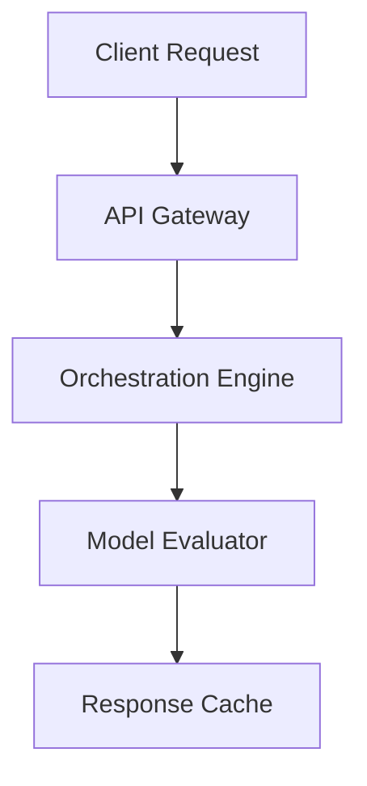

# Smart Telemetry Agent

Next-generation smart telemetry agent designed to streamline devops with minimal configuration.

[](https://opensource.org/licenses/MIT)
[](#tech-stack)
[](#contributing)

## Features
- **Real-time token usage, cost optimization, and latency monitoring**
- **Anomaly detection in agent reasoning paths and prompt inputs**
- **Export metrics directly to Prometheus, Grafana, and Datadog**
- **Cross-Platform**: Built on top of modern cross-platform technologies (Python 3.11+, Asyncio, Pydantic v2, FastAPI).

## Tech Stack
- Python 3.11+
- Asyncio
- Pydantic v2
- FastAPI

## Quick Start

```bash
# Clone the repository
git clone https://github.com/example/smart-telemetry-agent.git

# Setup and run
pip install -r requirements.txt
python main.py
```

## Architecture Diagram (Mermaid)


## Contributing
We welcome contributions! Please open an issue or submit a pull request for any improvements.

## License
This project is licensed under the MIT License - see the LICENSE file for details.
